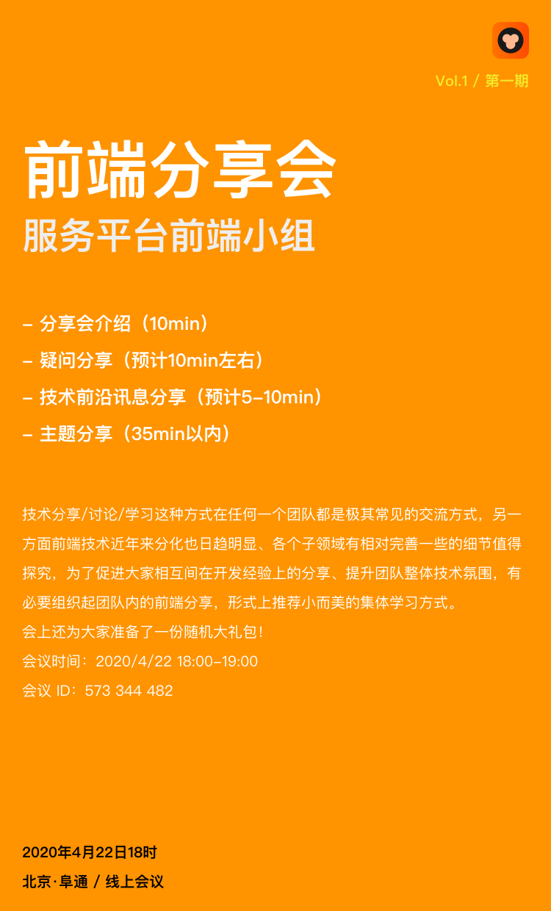

# Vol.1 - 2020.04.22

## 疑问分享

### 1. 代码规范

* 线上问题：用 get 方法定义流，内部 return combineLatest ，如果依赖的流没有在提前定义好，其他变量定义调用这个流的时候拿到 undefined，出现 bug
  * 简单举例：`get A$() { return combineLatest( B$, C$ ) ... }; D$ = A$; B$=...; C$=...;` 用 get 的方式定义 A 这个流，依赖 B 和 C，D = A，B、C 流在后面定义，因为 get 是调用时才执行这里不会报错，但是 D 获取 A 的时候由于所依赖的 B、C 都没有定义，所以拿不到值，成为隐藏 bug
  * 解决方案及建议：（1）按照依赖顺序定义变量 （2）尽量使用直接定义的方式，没有特殊必要的时候不用 get 这种定义形式

* getter 嵌流的写法如果不妥当，在模版中会不停调用，引发 angular view check 影响性能
* 书写过程中缺少 shareaReplay 导致性能问题
 
### 2. 最佳实践

* controlService 中 BehaviorSubject 返回 Observable 的设计初衷和使用建议 - 推荐通过流的方式去获取值，不要用 .value
* 现有 controlService 中代码较多，是否有引入状态管理库的必要
* Subject 与变体的使用建议：比如 BehaviorSubject 和 ReplaySubject 的用法实践不熟导致一些问题等
 
### 3. 业务讨论

* 平台上的截图功能用 headless-chrome 替代 canvas 绘制
* 前端编译特别慢，线上部署也很慢，有的时候后端都好了我们还没编译完，有没有优化的空间 - 后续可能需要上微前端架构对项目进行拆分
* 哆啦的消息懒加载，后续可以分享

## 技术前沿讯息分享

* [GitHub 宣布正式收购 npm](https://www.infoq.cn/article/oafbML7W8yeBRyT7dl61) - 3 月14 日，业界便有消息称GitHub 计划收购广受欢迎的开源JavaScript 包管理服务npm，如今看来，该笔收购已经正式完成。 npm 全拼为Node Package Manager，是JavaScript 软件包管理器。
* [深入理解 CSS3 弹性盒布局模型](https://www.ibm.com/developerworks/cn/web/1409_chengfu_css3flexbox/index.html)

## 主题分享

* 分享主题 / Coding with Angular - Tips and tricks @hijiangtao
* [Slides 链接](https://hijiangtao.github.io/slides/s-YFD/Coding-with-Angular-Tips-and-Tricks.html#/)
* 简介 - 当你第一次从其他框架切换到 Angular 是否会有些迷茫，在感叹框架大而全的同时却对其中很多概念不尽了解？不要害怕，跟着本文一起，从新手的角度去看看有哪些最佳实践值得学习。

## Next

* 分享主题 / FNC OssService 实现和解读 @wangxg6
* 简介 - fnc 公共库里面 oss 交互的实现，以及怎么通过前端和服务端协作完成 oss 文件鉴权，使用 oss 的几种产品实践。
