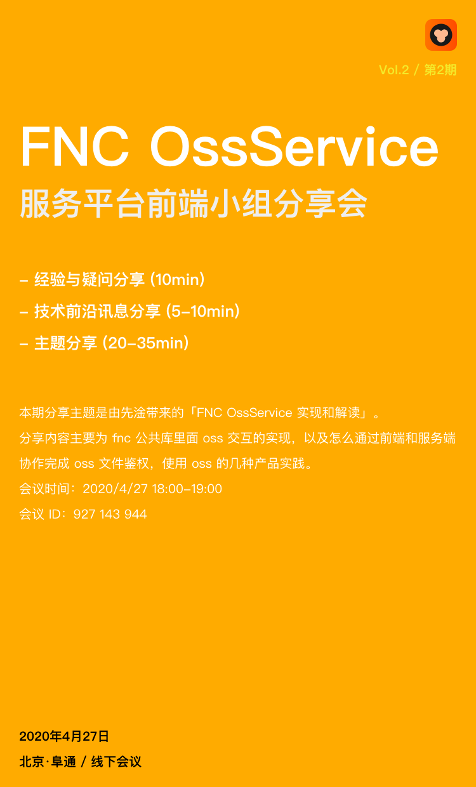

# Vol.2 - 2020.04.27

## 疑问分享

### 1. 开发流程/规范

* 建议大家在开发中建议重视类型的定义，建议以约定的文档入手、熟悉各开发分支的用法和 ci 策略
* 服务平台公共组件包（based on monkeyD），持续建设中（文档+流程）
* 项目部署细节需要注意，比如 base-href
* 项目性能优化，待有时间总结分享
* 如何写好 DRY 代码的一些实践经验/建议

### 2. 开发体验

* 在使用 Ant Design 的过程中存在一些不利于开发的问题，比如基于开源库的自定义组件开发不好扩展
* TSLint 配置路径别名在自定义 library 中不生效

## 技术前沿讯息分享

* Flutter 使用者仍在快速增长。自发布以来的 16 个月内，已有 200 万开发者使用 Flutter。
* jsPDF - 一款 JavaScript 转 PDF 的开源库 <https://github.com/MrRio/jsPDF>

## 主题分享

* FNC OssService 实现和解读 @wangxg6
* Slides [链接](./slides/2020-04-27-Tnc-OssService.pdf)
* 简介 - fnc 公共库里面 oss 交互的实现，以及怎么通过前端和服务端协作完成 oss 文件鉴权，使用 oss 的几种产品实践。

## Next

TBD