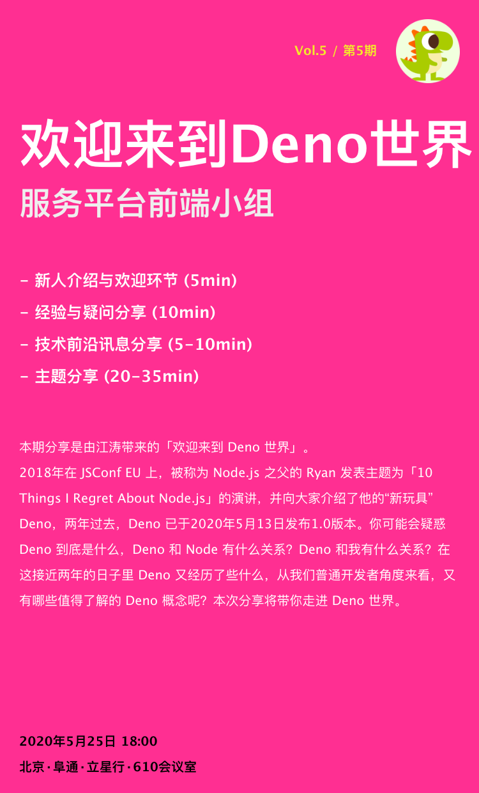

# Vol.5 - 2020.05.25

## 疑问分享

### 1. 开发流程/规范

* pageckage 版本号没有锁死导致 bug，在冲突的时候删掉 pckage-lock.json 再 npm install 覆盖。 npm 升级到最新。
* ng 9 升级后，遇到细碎的问题比较多。 test 环境 build 失败是切环境导致脏数据。缓存 package-lock.json 的有问题。  
* antd 升级比预期复杂:
    * nzModel bug  
    * 样式问题比较多 
    * 自定义排序组件导致表格样式错乱。

### 2. 开发体验

* 开发过程中遇到 css 样式问题， 建议来一期分享。

## 技术前沿讯息分享

* Microsoft Build 2020: https://www.youtube.com/watch?v=S_wNRx7f7rU

## 主题分享

* 分享主题 欢迎来到 Deno 世界 @hijiangtao
* Slides [链接]( https://hijiangtao.github.io/slides/s-YFD/Welcome-to-Deno-World#/)
* 简介 -  2018年在 JSConf EU 上，被称为 Node.js 之父的 Ryan 发表主题为「10 Things I Regret About Node.js」的演讲，
并向大家介绍了他的“新玩具” Deno，两年过去，Deno 已于2020年5月13日发布1.0版本。你可能会疑惑 Deno 到底是什么，Deno 和 Node 有什么关系？
Deno 和我有什么关系？在这接近两年的日子里 Deno 又经历了些什么，从我们普通开发者角度来看，又有哪些值得了解的 Deno 概念呢？本次分享将带你走进 Deno 世界。

## Next

* 分享主题 Clean Code @wangxg6
