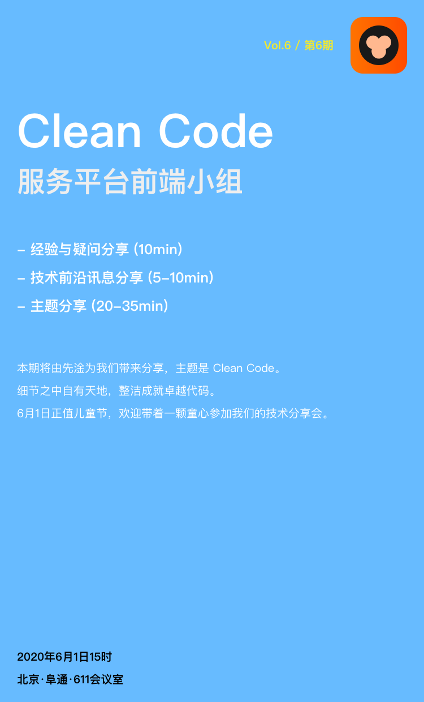

# Vol.6 - 2020.06.01

## 疑问讨论

* 组件开发尽量定义清楚类型，不论是正常定义方式还是传入的自定义组件节点

## 业务方案分享

* [Angular 中状态管理方案调研](https://hijiangtao.github.io/2020/05/08/Angular-State-Management-Invest-Report/)
* [前端组件库本地开发调试的自动化流程实现](https://hijiangtao.github.io/2020/05/21/A-Better-Library-Development-Workflow/)

## 技术前沿讯息分享

* [HTTP/3 来了，未来可期](https://mp.weixin.qq.com/s/B7jnJUkAFIxVmQpv1cOaYg) - 2015 年 HTTP/2 标准发表后，大多数主流浏览器也于当年年底支持该标准。此后，凭借着多路复用、头部压缩、服务器推送等优势，HTTP/2 得到了越来越多开发者的青睐，不知不觉的 HTTP 已经发展到了第三代。本文基于兴趣部落接入 HTTP/3 的实践，聊一聊 HTTP/3 的原理以及业务接入的方式。

## 主题分享

* 分享主题 / Clean Code /  @wangxg
* [Slides 链接](./slides/2020-06-01-Clean-Code.pdf)
* 简介 - 细节之中自有天地，整洁成就卓越代码。

## Next

* 分享主题 / Serverless - 给前端无限可能 @liuwenwen
* 简介 - 回顾前端一路以来的技术变革史，从原始的静态表单到无缝刷新的 ajax，前端工程师的能力模型逐渐从 UI 偏向逻辑和数据；从涉足服务端领域的 Node.js 到 Vue、React、Angular 全家桶，前端工程师的涉猎领域扩大到组件化生态与前端工程化。在一个完整的开发生态里，前端工程师被赋予越来越多的能力与角色。目前有两种声音：一是前后端包揽的“大前端”，也就是全栈。二是以 React-Native 和 Flutter 为突破点的“泛前端”，即全端。身为一名前端工程师，我们不会只局限于前端领域自身，“全栈”一直以来都是我们不断追求的新标签。那么问题来了，目前为止，“全栈”的标签，我们可以贴上吗，掌握 Node.js，就代表全栈了吗？带着这个疑问，我们进入今天的分享主题 Serverless，一个真正让前端工程师贴上“全栈”标签的无服务器云开发模式。What is serverless? Less is more.
