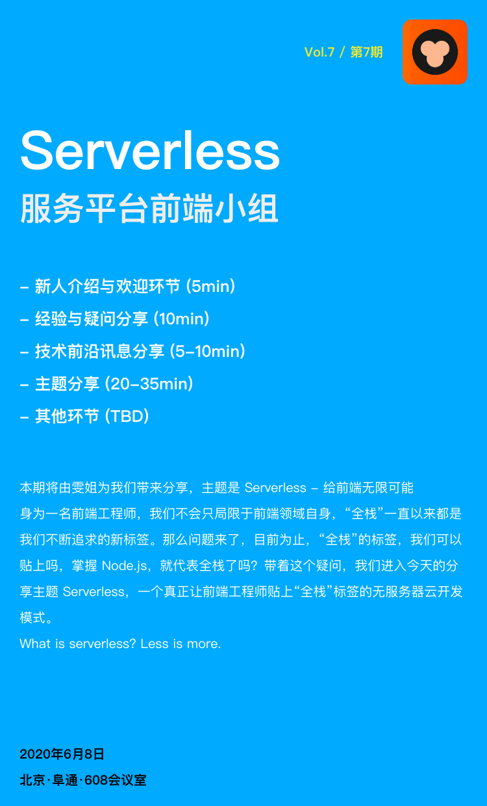

# Vol.6 - 2020.06.01

## 疑问讨论

* OSS 上传的使用场景枚举过多、组件库抽象需求模糊，导致沟通返工问题比较严重，浪费较多时间和精力
* [WIP] 业务二方包的开发流程规范
* 新手任务中可能会用到的组件 API 定义不清晰（组件过时），存在疑惑，有必要更新一版
* 复杂的需求用 RxJs 会使数据流复杂化，以及在复杂需求场景下多个数据流之间交互影响导致代码可读性变差，感兴趣的同学可以跟进讨论

## 主题分享

* 分享主题 / Serverless - 给前端无限可能 /  @liuwenwen
* [Slides 链接](./slides/2020-06-08-sseverless.pdf)
* 简介 - 简介 - 回顾前端一路以来的技术变革史，从原始的静态表单到无缝刷新的 Ajax，前端工程师的能力模型逐渐从 UI 偏向逻辑和数据；从涉足服务端领域的 Node.js 到 Vue、React、Angular 全家桶，前端工程师的涉猎领域扩大到组件化生态与前端工程化。在一个完整的开发生态里，前端工程师被赋予越来越多的能力与角色。目前有两种声音：一是前后端包揽的“大前端”，也就是全栈。二是以 React-Native 和 Flutter 为突破点的“泛前端”，即全端。身为一名前端工程师，我们不会只局限于前端领域自身，“全栈”一直以来都是我们不断追求的新标签。那么问题来了，目前为止，“全栈”的标签，我们可以贴上吗，掌握 Node.js，就代表全栈了吗？带着这个疑问，我们进入今天的分享主题 Serverless，一个真正让前端工程师贴上“全栈”标签的无服务器云开发模式。What is serverless? Less is more.

## Next

* 分享主题 / 服务端渲染 @huangchufeng
* 简介 - 
