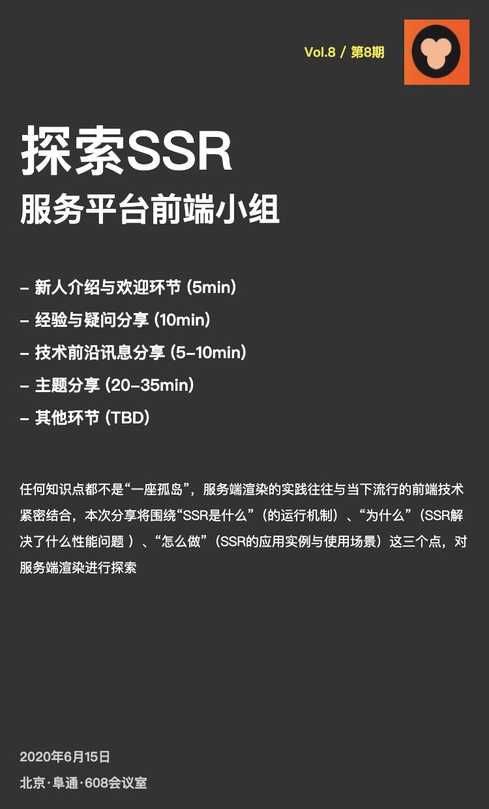

# Vol.8 - 2020.06.15

## 疑问讨论
* 上线流程不清晰，规范自己不是很清楚，新同学之后可以多关注一下
* 代码风格、规范没有具体文档，比较懵
* 发现focus打包体积过大，进行bundle分析，发现项目中一些不必要的三方依赖以及冗余代码，进行了这部分内容的优化，从而优化构建时长。之后大家在开发过程也要多注意bundle优化相关的事情，精简代码、剔除没必要的三方依赖等。

## 技术前言讨论
* 1. [https://utf-8.jp/public/aaencode.html](https://utf-8.jp/public/aaencode.html)
* 2. JavaScript Most Errors [https://rollbar.com/blog/top-10-javascript-errors/](https://rollbar.com/blog/top-10-javascript-errors/)

## 主题分享
*  分享主题：探索服务端渲染（SSR）@huangchufeng
* [Slides 链接](./slides/2020-06-15-ssr.pdf)
*  简介：任何知识点都不是“一座孤岛”，服务端渲染的实践往往与当下流行的前端技术紧密结合，本次分享将围绕“SSR是什么”（的运行机制）、“为什么”（SSR解决了什么性能问题 ）、“怎么做”（SSR的应用实例与使用场景）这三个点，对服务端渲染进行探索

## Next
* Angular 生命周期@chenjinzhu
* 简介：angular生命周期与变更检测机制。基础应用、实例及坑。
