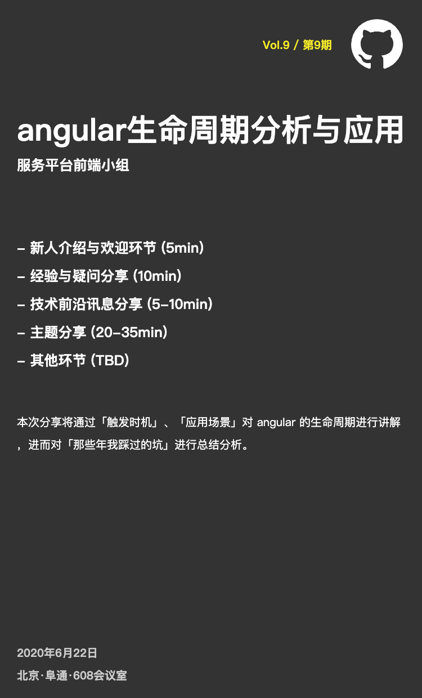

# Vol.9 - 2020.06.22

## 疑问讨论
* focus给pipe和util加了单测，通过单测增加代码可用性，提高单测覆盖率
* 发包问题，忘记antd是8版本，不兼容，后面升级
* antd 9 发了9.2.1版本, 变化比较大，后面大家一起改下
* antd 9 版本的table的filter功能跟8版本不一样
* focus-ng-common dist目录，后面加下
* ng lint 顺序
* https://indepth.dev/angular-forms-useful-tips/

## 技术前沿

无

## 主题分享
* Angular 生命周期 @陈金珠 
* [Slides 链接](./slides/2020-06-22-angular生命周期.pdf)
* 简介：angular生命周期与变更检测机制。基础应用、实例及坑。

## Next
* RxJS介绍 @杨琳 
* 简介：本次分享将通过「Subscribe」、「操作符」、「多播」对RxJs 进行讲解
