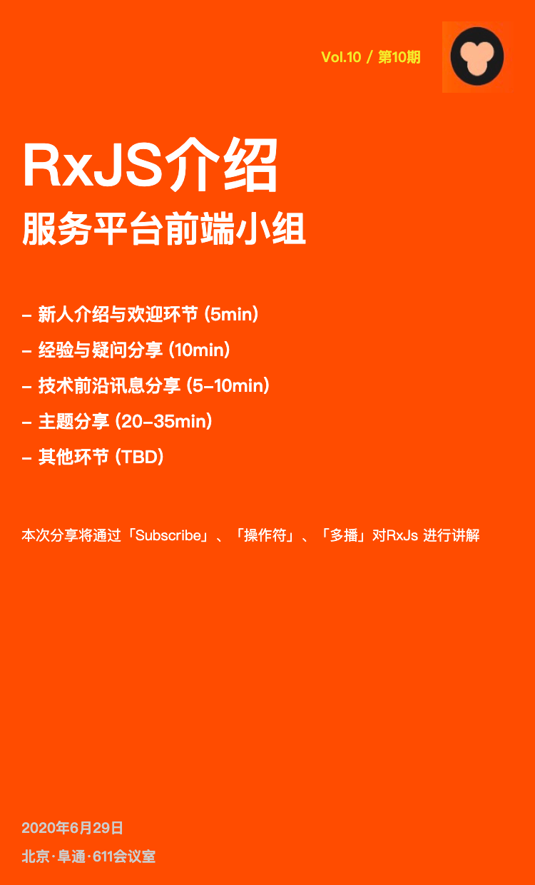

# Vol.10 - 2020.06.29

## 疑问讨论
* 少用ng-deep，可以通过theme.less全局配置
* 业务状态码和http状态码
* 「提高编译速度」分享
* soft-edit无法聚焦，参考代码：https://gerrit.zhenguanyu.com/c/tutor-wb-web/+/743465
* 下周分享canvas
* antd9分组表格 & 滚动 需要配置单元格宽度

## 技术前沿

* angular 10 发布了

## 主题分享
* RxJS介绍 @杨琳 
* [Slides 链接](./slides/2020-06-29-rxjs.pdf)
* 简介：通过「Subscribe」、「操作符」、「多播」对RxJs 进行讲解。

## Next
* 「聊聊TS」@刘思齐
*  简介：TS是我们日常开发中每天都在使用的技术，本周分享我们就来聊聊这个看起来无处不在的TS。探讨一下它的用法、作用，以及在我们项目中的使用。
